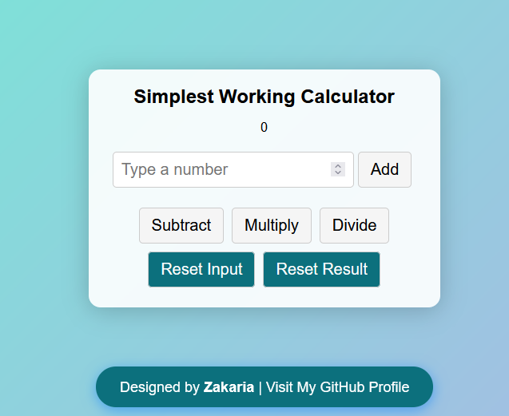

# ✨ Simple Calculator App ✨

## 🌟 Overview

Welcome to my React project: **Simple Calculator App**! This elegant React-based application allows you to effortlessly perform basic arithmetic operations: addition, subtraction, multiplication, and division. Designed with a clean and user-friendly interface, this app is perfect for anyone looking to perform quick calculations with style.

*Screenshot of the React Simple Calculator App*

## 🎨 Features

- **Basic Operations**: Seamlessly perform addition, subtraction, multiplication, and division.
- **User-Friendly Interface**: A sleek design that enhances your experience.
- **Responsive Design**: Optimized for various screen sizes, ensuring accessibility on all devices.

## 📁 Project Structure

The project consists of the following files:

- **`package.json`**: Contains project metadata and dependencies.
- **`public/index.html`**: The main HTML file that serves the app.
- **`src/App.css`**: Styles for the calculator app.
- **`src/App.js`**: The main React component for the calculator functionality.
- **`src/index.js`**: The entry point for the React application.

## 🚀 Getting Started

1. **Clone the Repository**: Download the project to your local machine.
2. **Navigate to the Project Directory**: Open your terminal and go to the project folder.
3. **Install Dependencies**: Run `npm install` to set up the necessary packages.
4. **Start the Development Server**: Execute `npm start` to launch the app.
5. **View in Browser**: Open your browser and navigate to `http://localhost:3000` to see your calculator in action.

## 💡 Usage

- **Input a Number**: Type a number into the input field.
- **Perform Calculations**: Click the corresponding operation button (add, subtract, multiply, divide) to see the results.
- **Reset Options**: Use the reset buttons to clear the input or reset the displayed result.

## 🤝 Contributing

We welcome contributions! Feel free to fork the repository and submit pull requests for any enhancements or new features you'd like to add.

## 📜 License

This project is open-source and available under the MIT License. Enjoy coding with style!

